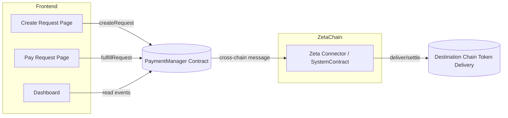

# Architecture

Components:
- PaymentManager: creates/fulfills requests, emits events, integrates ZetaChain for settlement
- ZetaChain: transports cross-chain messages and assets; settles preferred token on destination chain
- Frontend: UX for creating, paying, and tracking requests
